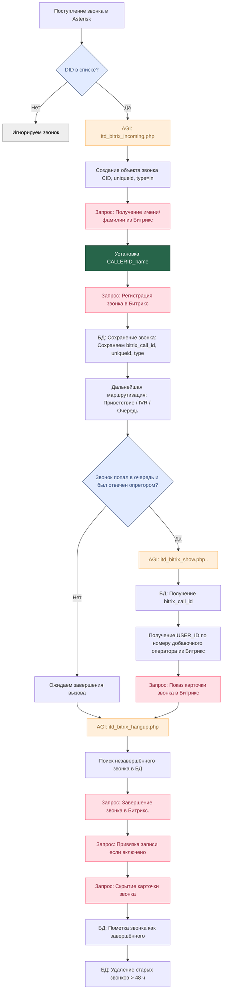

# itd-bitrix
FreePBX integration module for Bitrix24

Выполнить shell-скрипт, install.sh:
<code>
#!/bin/bash
fwconsole setting MODULE_REPO https://nnekipelov.github.io/itd-bitrix/modules-15-itd.xml
fwconsole ma refreshsignatures
</code>

